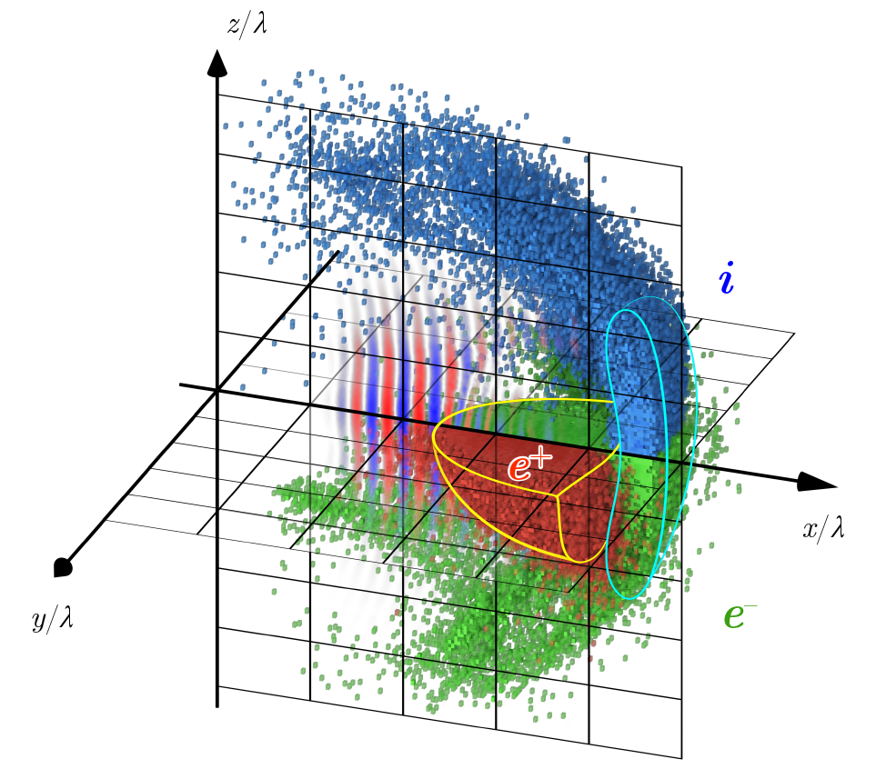

## Дополнительные материалы к стэндовому докладу "КЭД каскад, возникающий при взаимодействии экстремально интенсивного лазерного излучения с веществом"

### Распределение плотности частиц и электромагнитной энергии

Зелёные - электроны, синие - ионы, красные - позитроны, оранжевая - плотность электромагнитной энергии.

### Распределение частиц в пространстве

### Траектории позитронов

### Механизм самоподдерживания КЭД каскада

### Ссылки
A. S. Samsonov, E. N. Nerush, and I. Yu. Kostyukov, /Phys. Rev. A/ *98*, 053858 (2018) [.pdf](2018%20-%20Samsonov%20-%20PRA.pdf)

A. S. Samsonov, E. N. Nerush, and I. Yu. Kostyukov, /Sci. Rep./ *9*, 11133 (2019) [.pdf](2019%20-%20Samsonov%20-%20SciRep.pdf)

Постер [.pdf](Постер_git.pdf)
